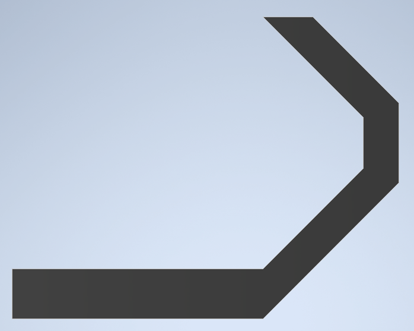
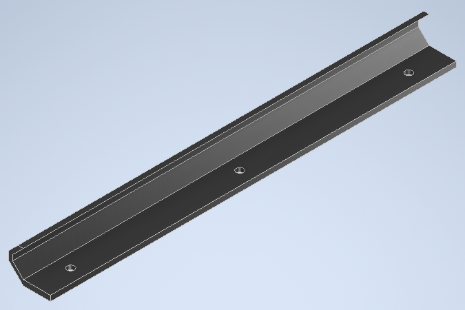
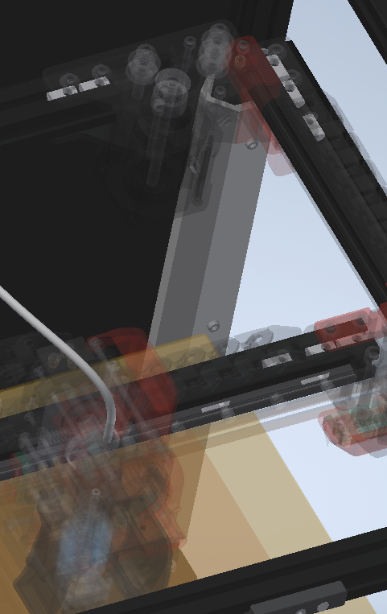

# Trident Rear Rail Wire Cover

This mod covers the wires on the back-rear extrusion so you don't have to look at them. This is the wire bundle that includes all the hot-end wires and the end-switch pod. 

Print with standard Voron print settings, no supports.

It was hard for me to get a good view in CAD. This is the best I could do.